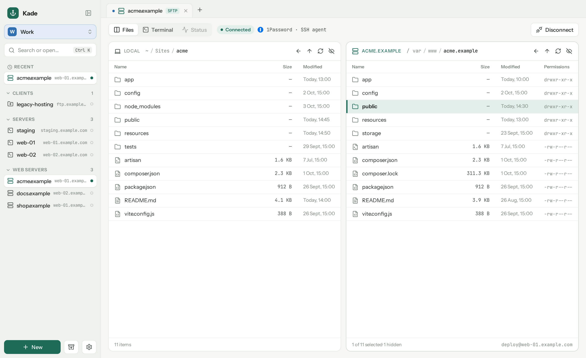
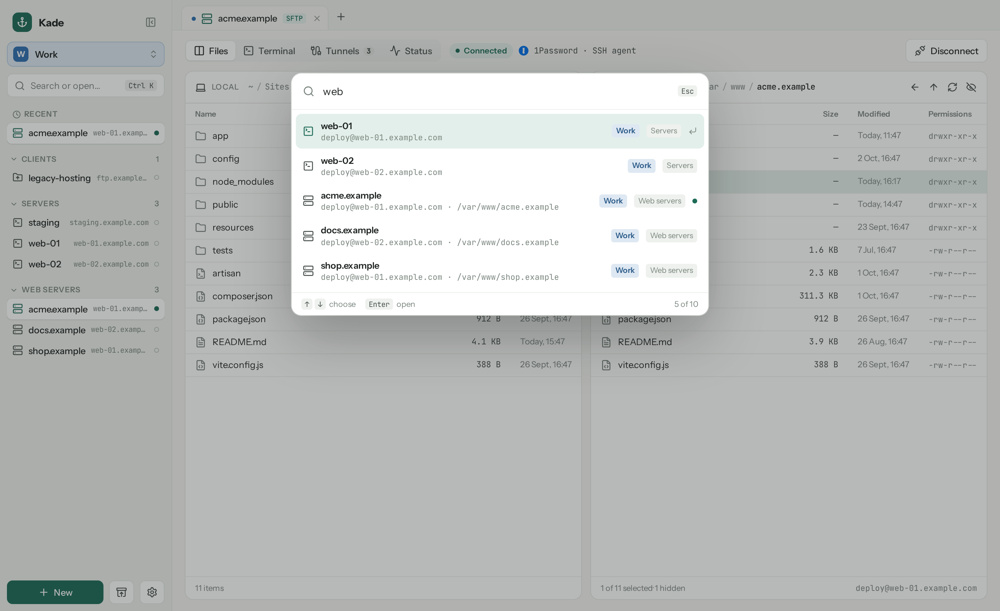
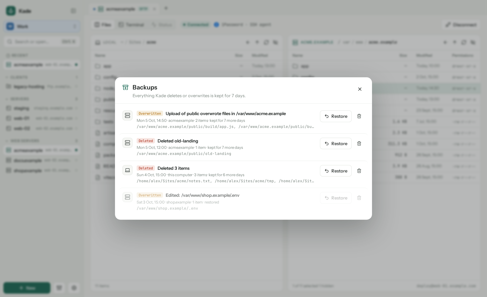
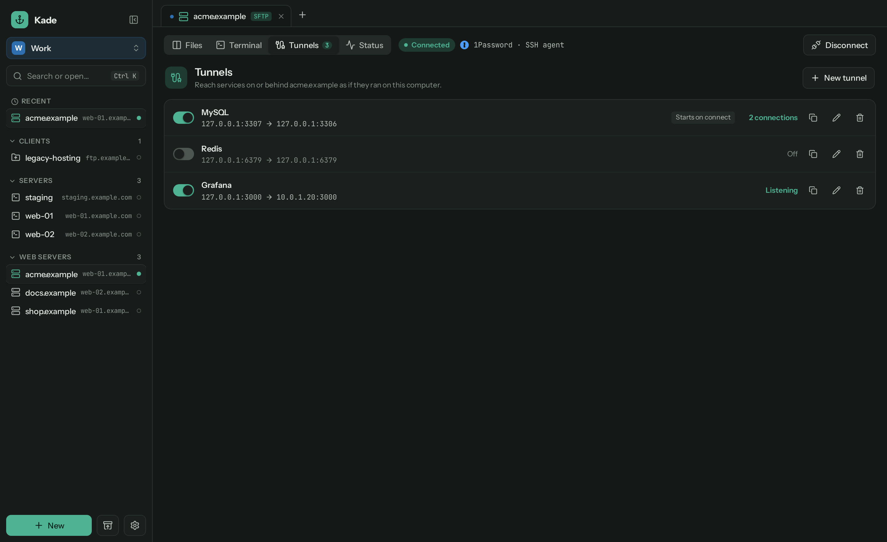
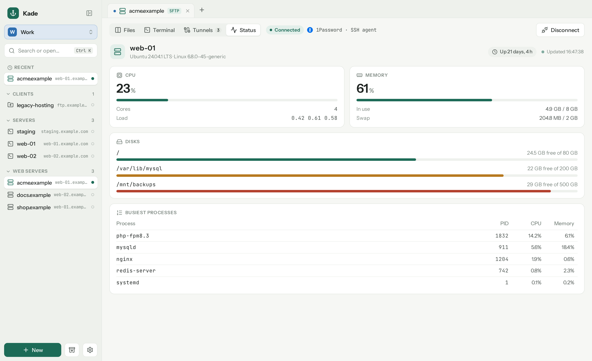
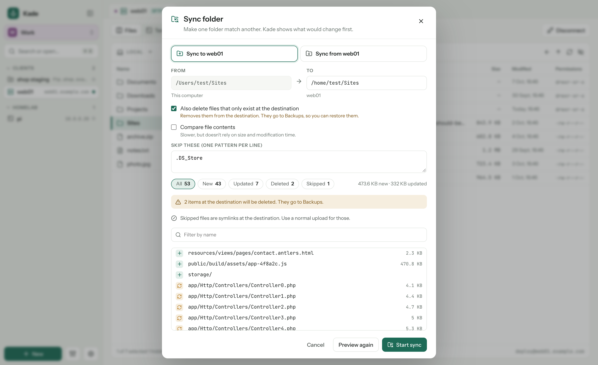
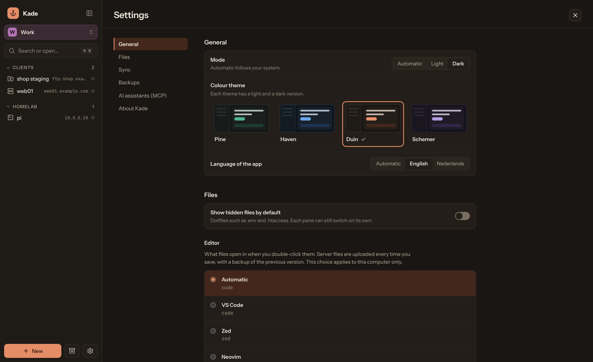

# Kade

A friendly SSH, SFTP and FTP manager for Linux and macOS, in the spirit of Transmit.



- **Workspaces** (say, Home and Work) with groups of connections, each with its own colour and default
  1Password account, vault and SSH key (connections without a key of their own try only that one). Every computer remembers its own active workspace (Ctrl 1–9).
- **SFTP, SSH, FTP and FTPS** (explicit on port 21, implicit on 990).
- **Two panes**, local and server, with drag and drop and a right-click menu: new file or folder, rename,
  delete, edit.
- **Terminal** over the same SSH connection (xterm.js).
- **Tunnels**: forward ports from the server to this computer (like `ssh -L`), saved per connection and
  optionally started on connect. Handy for a database client or an admin page that only listens locally.
- **Status**: CPU, memory, disks and the busiest processes of a server, refreshed live.
- **Edit in your own editor**: double-click a server file and Kade uploads it every time you save.
- **Backups of everything Kade deletes or overwrites**, kept for a configurable number of days and restorable
  with one click. They are journaled as they happen, so a crash mid-transfer loses nothing, and unsaved edits are kept too.
- **Sign in** with the 1Password SSH agent, ssh-agent, a key file, a password from 1Password (through the `op`
  CLI) or a password you type (never stored). Host keys are checked against `~/.ssh/known_hosts`.
- **Sync folder** over rsync: right-click a folder and choose Sync to or from the server. Kade previews every
  change first, can delete extra files at the destination, and puts everything it overwrites or deletes in
  Backups. It runs over Kade's own SSH connection, so 1Password and agent sign-in keep working. Needs rsync on
  both ends.
- **Sync** connections and settings between computers through a folder your sync client keeps in step
  (Syncthing, iCloud Drive, Synology Drive, …). Passwords are never written to it.
- **MCP server** inside the app (Settings → AI assistants), so an assistant such as Claude Code can add, change,
  test and open connections. Off by default; listens on 127.0.0.1 only and requires a token.
- **Import** connections from `~/.ssh/config`, Cyberduck, FileZilla and Transmit (Settings → Import). Passwords
  are never imported.
- **Updates** from inside the app (Settings → About Kade).
- **Light and dark**, following the system or chosen in Settings, with four colour themes (Pine, Haven, Duin and
  Schemer). The terminal follows the theme.
- **English and Dutch**, chosen automatically or in Settings → Language.

<table>
  <tr>
    <td></td>
    <td></td>
  </tr>
  <tr>
    <td align="center"><sub>Quick open (Ctrl K) across workspaces</sub></td>
    <td align="center"><sub>Every delete and overwrite can be restored</sub></td>
  </tr>
  <tr>
    <td></td>
    <td></td>
  </tr>
  <tr>
    <td align="center"><sub>Tunnels, in dark mode</sub></td>
    <td align="center"><sub>Live server status</sub></td>
  </tr>
  <tr>
    <td></td>
    <td></td>
  </tr>
  <tr>
    <td align="center"><sub>Sync a folder, after a preview</sub></td>
    <td align="center"><sub>Four colour themes, light and dark</sub></td>
  </tr>
</table>

## Install

### macOS

```sh
curl -fsSL https://github.com/jurnskie/kade/releases/latest/download/install-macos.sh | bash
```

This downloads the latest universal build (Apple Silicon and Intel), verifies its checksum and installs
`Kade.app` in Applications. Run it again to update.

Kade isn't signed with an Apple Developer ID yet. The install script removes the quarantine flag so Gatekeeper
lets it start; if you download the zip by hand, right-click Kade.app → Open the first time.

### Linux

```sh
curl -fsSL https://github.com/jurnskie/kade/releases/latest/download/install-linux.sh | bash
```

Installs the AppImage as `~/.local/bin/kade` with a shortcut in your app launcher; no root needed. Run it again
to update. Every [release](https://github.com/jurnskie/kade/releases) also has a `.deb` for Debian and Ubuntu.
Only x86_64 builds are published; on other architectures, build from source.

### 1Password

To sign in with keys or passwords from 1Password, turn on these settings in 1Password → Settings → Developer:

- **Use the SSH agent**, for SSH keys
- **Integrate with 1Password CLI**, for passwords (FTP) and for keys from a vault that the agent doesn't offer

With more than one 1Password account (personal and work, for example), choose the account per connection or per
workspace.

## Build from source

You need Rust (stable), Node 22+ and pnpm. On Linux you also need the
[Tauri prerequisites](https://v2.tauri.app/start/prerequisites/) (`webkit2gtk-4.1` and friends).

```sh
pnpm install
pnpm tauri dev      # run in development
pnpm tauri build    # build bundles in src-tauri/target/release/bundle
```

On macOS, `./scripts/install-macos.sh --source` builds and installs in one go.

Stack: Tauri 2, Svelte 5, Rust with `russh`, `russh-sftp` and `suppaftp`.

## Tests

```sh
pnpm check                    # Svelte and TypeScript
cd src-tauri && cargo test    # Rust unit tests
```

The end-to-end tests (transfers, backups, restores, status, tunnels) need an SSH server that accepts a test key for your own
user, for example an unprivileged `sshd` on `127.0.0.1:2222`:

```sh
KADE_E2E_PORT=2222 KADE_E2E_KEY=/path/to/test-key cargo test -- --ignored e2e
```

For FTP and FTPS, run two vsftpd servers (user `kade`, password `secret`), plain on port 2121 and with TLS on
2122, each serving a directory. FTPS needs a certificate from a CA you pass with `KADE_EXTRA_CA`:

```sh
KADE_E2E_FTP_ROOT=/srv/ftp KADE_E2E_FTPS_ROOT=/srv/ftps KADE_EXTRA_CA=/path/to/ca.pem \
  cargo test -- --ignored e2e_ftp
```

`KADE_EXTRA_CA` works in the app too, for servers with a certificate from your own CA.

## Translations

UI strings are written in English in the code (`t("…")` in Svelte, `tr!("…", "…")` in Rust). Dutch translations
live in `src/lib/locales/nl.ts` and next to the English text in `tr!`. See [CONTRIBUTING.md](CONTRIBUTING.md).

## Releasing

```sh
./scripts/release.sh 0.4.0
```

Bumps the version, tags and pushes. GitHub Actions then builds the macOS and Linux bundles and publishes them as
a release.

## License

[MIT](LICENSE)
